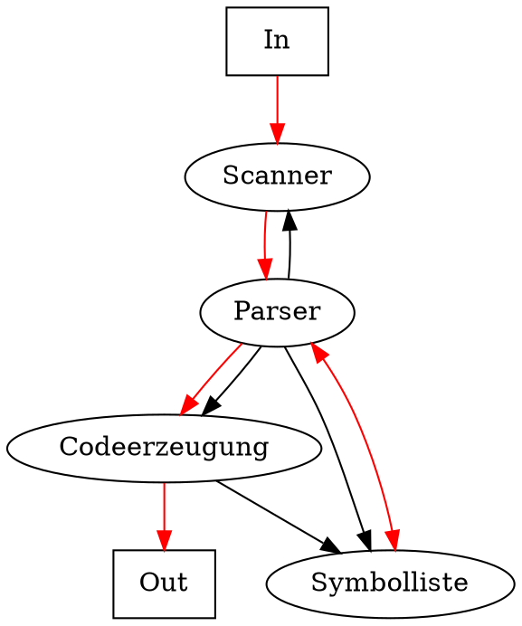

# Compiler

**Dynamische Struktur**: *Zeichenstrom* => Lexikalische Analyse (Scanning) => *Tokenstrom* => Syntaxanalyse (Parsing) => *Syntaxbaum* => Semantische Analyse (Typprüfung, etc) => *Zwischensprache* => Optimierung => Codeerzeugung => *Maschinencode*

**Mehrpass-Compiler**: Jede Phase liest und schreibt in eine Datei. Nützlich bei zu wenig Hauptspeicher, komplexen Programmen oder für eifache Portierbarkeit.

**Einpass-Compiler**: Zielprogramm wird direkt aus Quellprogramm erzeugt.

## Zweipass-Compiler

**Front-End**: sprachabhängig => Scanning, Parsing, Sem. Analyse.  

**Back-End**: maschinenabhängig => Codeerzeugung

*Quellcode* => Front-End => *Zwischensprache/Datenstruktur* => Back-End => *Maschinencode*

* Bessere Portierbarkeit
* Front/Back-End beliebig kombinierbar
* Zwischensprache ist einfacher zu optimieren
* Etwas langsamer
* Mehr Speicher nötig

## Interpreter

Führt das Quellprogramm direkt aus:

*Quellcode* => Scanner => Parser => Interpretation

oder mit einer virtuellen Maschine welche den Code interpretiert und eine physische Maschine simuliert: 

*Quellcode* => Compiler => *Zwischencode* => VM

## JIT Compilation

Just-In-Time compilation heisst, dass der Code für die virtuelle Maschine zur Ladezeit in Maschinencode übersetzt wird. Effektiv wird dann der Maschinencode ausgeführt, was schneller ist.

**all-in-one**: Code wir beim Laden übersetzt. Verzögert den Programmstart.

**incremental**: Code wir vor der ersten Ausführung übersetzt (z.B. auf Methoden-Ebene).

**hot-spot**: Code wird interpretiert und das Programm startet sofort. Häufig verwendete Abschnitte werden in Maschinencode übersetzt.

## Statische Struktur

**Scanner**: Liefert Tokens aus dem Quelltext

**Parser**: Steuert die gesamte Übersetzung

**Symbolliste**: Verwaltet deklarierte Namen und Typen

**Codeerzeugung**: Erzeugt Maschinencode

```dot
digraph legend { 
    rankdir = LR;
    node [shape=plaintext]
    key [label=<<table border="0" cellpadding="2" cellspacing="0" cellborder="0">
          <tr><td align="right" port="i1">Datenfluss</td></tr>
          <tr><td align="right" port="i2">Aufrufbeziehung</td></tr>
          </table>>]
    key2 [label=<<table border="0" cellpadding="2" cellspacing="0" cellborder="0">
          <tr><td port="i1">&nbsp;</td></tr>
          <tr><td port="i2">&nbsp;</td></tr>
          </table>>]
        key:i1:e -> key2:i1:w [color=red]
        key:i2:e -> key2:i2:w [color=black]
}
```

 

 
 
 

## Grammatik

