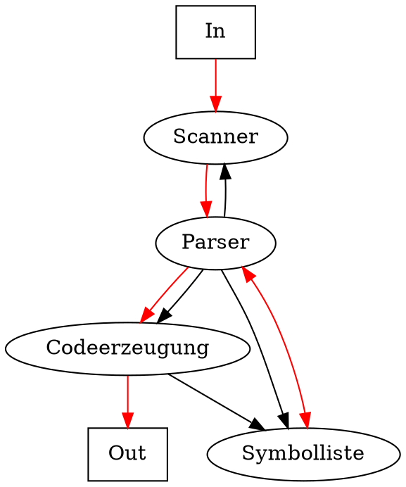

<!-- Compiler V1 -->

# Compiler

**Dynamische Struktur**: *Zeichenstrom* => Lexikalische Analyse (Scanning) => *Tokenstrom* => Syntaxanalyse (Parsing) => *Syntaxbaum* => Semantische Analyse (Typprüfung, etc) => *Zwischensprache* => Optimierung => Codeerzeugung => *Maschinencode*

**Mehrpass-Compiler**: Jede Phase liest und schreibt in eine Datei. Nützlich bei zu wenig Hauptspeicher, komplexen Programmen oder für eifache Portierbarkeit.

**Einpass-Compiler**: Zielprogramm wird direkt aus Quellprogramm erzeugt.

## Zweipass-Compiler

**Front-End**: sprachabhängig => Scanning, Parsing, Sem. Analyse.  

**Back-End**: maschinenabhängig => Codeerzeugung

*Quellcode* => Front-End => *Zwischensprache/Datenstruktur* => Back-End => *Maschinencode*

* Bessere Portierbarkeit
* Front/Back-End beliebig kombinierbar
* Zwischensprache ist einfacher zu optimieren
* Etwas langsamer
* Mehr Speicher nötig

## Interpreter

Führt das Quellprogramm direkt aus:

*Quellcode* => Scanner => Parser => Interpretation

oder mit einer virtuellen Maschine welche den Code interpretiert und eine physische Maschine simuliert: 

*Quellcode* => Compiler => *Zwischencode* => VM

## JIT Compilation

Just-In-Time compilation heisst, dass der Code für die virtuelle Maschine zur Ladezeit in Maschinencode übersetzt wird. Effektiv wird dann der Maschinencode ausgeführt, was schneller ist.

**all-in-one**: Code wir beim Laden übersetzt. Verzögert den Programmstart.

**incremental**: Code wir vor der ersten Ausführung übersetzt (z.B. auf Methoden-Ebene).

**hot-spot**: Code wird interpretiert und das Programm startet sofort. Häufig verwendete Abschnitte werden in Maschinencode übersetzt.

## Statische Struktur

**Scanner**: Liefert Tokens aus dem Quelltext

**Parser**: Steuert die gesamte Übersetzung

**Symbolliste**: Verwaltet deklarierte Namen und Typen

**Codeerzeugung**: Erzeugt Maschinencode

```dot
digraph legend { 
    rankdir = LR;
    node [shape=plaintext]
    key [label=<<table border="0" cellpadding="2" cellspacing="0" cellborder="0">
          <tr><td align="right" port="i1">Datenfluss</td></tr>
          <tr><td align="right" port="i2">Aufrufbeziehung</td></tr>
          </table>>]
    key2 [label=<<table border="0" cellpadding="2" cellspacing="0" cellborder="0">
          <tr><td port="i1">&nbsp;</td></tr>
          <tr><td port="i2">&nbsp;</td></tr>
          </table>>]
        key:i1:e -> key2:i1:w [color=red]
        key:i2:e -> key2:i2:w [color=black]
}
```

 

 
 
 

## Grammatik

Terminalsymbole (TS): Werden nicht zerlegt (e.g. if, >=, ident, number)

Nonterminalsymbole (NTS): Werden zerlegt (e.g.Condition, Statement, Type)

Produktionen: Ableitungsregel (e.g. Statement = Designator = Expr;)

Startsymbol: Oberstes NTS (e.g. Expression, Java, CSharp)

### EBNF

Extended Backus-Naur Form

|Symbol|Bedeutung|Beispiele|
|---|---|---|
|String|beddeutet sich selbst|=, while|
|Name|T- oder NT-Symbol|ident, Statement|
|=|trennt Regelseiten|A = b c d .
|.|schliesst Regel ab||
|&#x7c;|trennt Alternativen| a &#x7c; b &#x7c; c -> a oder b oder c |
|(...)|fasst Alternativen zusammen| a (b &#x7c; c) -> ab &#x7c; ac |
|[...]|Option| [a]b -> ab &#x7c; b |
|{...}|Wiederholung| {a}b -> b &#x7c; ab &#x7c; aab &#x7c; ... |

̣Konvetion
- TS beginnen mit Kleinbuchstaben
- NTS beginnen mit Grossbuchstaben

### Begriffe

Alphabet: Menge der TS und NTS einer Grammatik

Kette: Endliche Folge von Symbolen aus einem Alphabet -> &#x03B1;, &#x03B2;,...

Leere Kette: Kette, die kein Symbol enthält -> &#x03B5;

Phrase: Aus NTS ableitbare Kette (e.g. ident * Factor)

Satzform: Aus dem Startsymbol ableitbare Kette (e.g. Term + Factor * ident + Term)

Satz: Satzform, welche nur aus TS besteht (e.g. ident * number + ident)

Sprache (Formale Sprache): Menge aller Sätze einer Grammatik (meist unendlich), e.g. Sprache Java ist Menge aller gültigen Java Programme

### Rekursion

Eine Produktion is rekursiv, wenn `A -> w1 A w2`

Direkte Rekursion
- Linksrekursion: `A = b | A a.` => `A -> A a -> A a a`
- Rechtsrekursion: `A = b | a A.` => `A -> a A -> a a A`
- Zentralrekursion: `A = b | "(" A ")".` => `A -> (A) -> ((A))`

Indirekte Rekursion: `Expr -> Term -> Factor -> "(" Expr ")"`

Linkrekursion stört bei der Topdown-Syntaxanalyse

Umwandlung von Rekursion in Iteration: `E = T | E "+" T` => EBNF-Regel `E = T { "+" T }.`

### Klassen

Hierarchie von Noam Chomsky 1956
* Klasse 0: Unbeschränkte Grammatiken (Turingmashinen)
* Klasse 1: Kontextsensitive Grammatiken (linear beschränkte Automaten)
* Klasse 2: Kontextfreie Grammatiken (Kellerautomaten)
* Klasse 3: Reguläre Grammatiken (endliche AUtomaten)

Im Übersetzungsbau sind nur Klasse 2 und 3 relevant

### Abstrakter Syntaxbaum

Zeigt die Ableitungsstruktur für einen Satz einer Grammatik

Abstrakter Syntaxbaum (Abstract Syntax Tree)
- Vorrangregel: NTS weiter unten haben Vorrang vor NTS weiter oben

Expression Baum
- Blätter = Operanden
- Innere Knoten = Operatoren
- of als interne Programmdarstellung für Optimierungen

### Mehrdeutigkeit

Eine Grammatik ist mehrdeutig, wenn man für einen Satz mehrere Satzbäume angeben kann -> sind zur Syntaxanalyse ungeeignet

e.g. `id * id * id` kann mit zwei Syntaxbäume dargestellt werden 

Grammatik kann umgeformt werden, sodass nur eine Reihenfolge zulässig ist

Inhärente Mehrdeutigkeit -> lässt sich keine eindeutige Grammatik finden (e.g. Dangling Else)

## Lexikalische Analyse

- Liefert Terminalsymbole (Tokens)
- Überliest bedeutungslose Zeichen

### Reguläre Grammatiken

Grammatik ist regulär, wenn sie sich durch Regeln der folgenden Art ausdrückt 

    A = a.
    A = b B.  
    
mit a,b in TS und A,B in NTS

    Ident = letter
          | letter Rest.
    Rest  = letter
          | digit
          | letter Rest
          | digit Rest.

oder wenn sie sich durch eine einzige EBNF-Regel ohne rekursion ausdrücken lässt

    Ident = letter { letter | digit }.
    
    
Kann keine Klammerstrukturen ausdrücken -> keine Zentralrekursion möglich, für das braucht man kontextfreie Grammatiken

### Reguläre Ausrücken

    a b
    (a | b)
    (a)?        ε | a
    (a)*        ε | a | aa | ...
    (a)+        a | aaa | aaa | ...
    
    
### Endlicher Automat

Automat zur Erkennung einer regulären Sprache (DFA = deterministic finite automaton)

Scanner als DFA: Beginnt nach jedem erkannten Symbol wieder in Zustand 0

Nichtdeterministischer DFA (NDFA)
- Nicht deterministisch, wenn von einem Zustand zwei Übergänge für den selben Wert existieren
- Jeder NDFA kann in einen DFA umgewandelt werden

